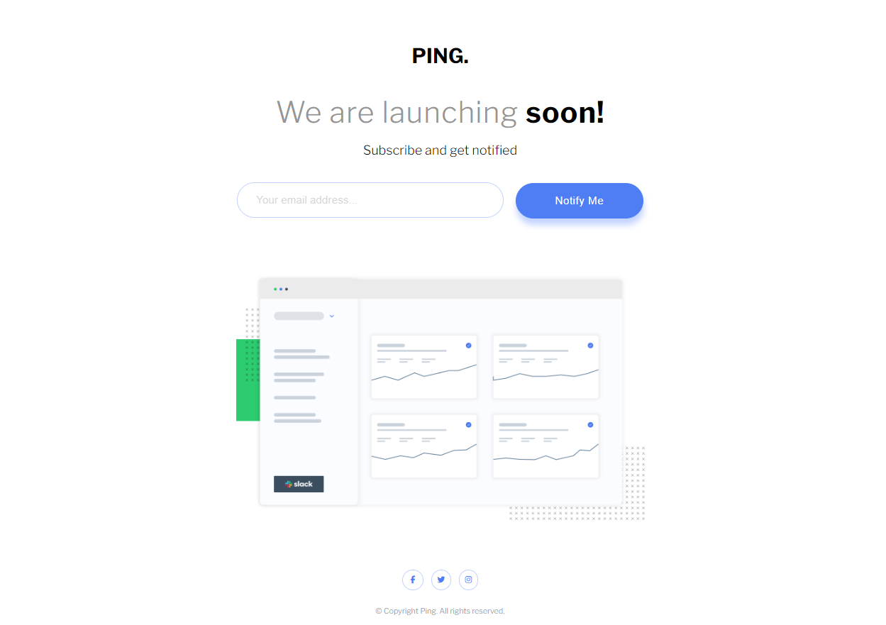

# Frontend Mentor - Ping coming soon page solution

This is a solution to the [Ping coming soon page challenge on Frontend Mentor](https://www.frontendmentor.io/challenges/ping-single-column-coming-soon-page-5cadd051fec04111f7b848da). Frontend Mentor challenges help you improve your coding skills by building realistic projects. 

## Table of contents

- [Overview](#overview)
  - [The challenge](#the-challenge)
  - [Screenshot](#screenshot)
  - [Links](#links)
- [My process](#my-process)
  - [Built with](#built-with)
  - [What I learned](#what-i-learned)
  - [Continued development](#continued-development)
  - [Useful resources](#useful-resources)
- [Author](#author)
- [Acknowledgments](#acknowledgments)

## Overview

### The challenge

Users should be able to:

- View the optimal layout for the site depending on their device's screen size
- See hover states for all interactive elements on the page
- Submit their email address using an `input` field
- Receive an error message when the `form` is submitted if:
	- The `input` field is empty. The message for this error should say *"Whoops! It looks like you forgot to add your email"*
	- The email address is not formatted correctly (i.e. a correct email address should have this structure: `name@host.tld`). The message for this error should say *"Please provide a valid email address"*

### Screenshot



### Links

- Solution URL: https://github.com/Simplify4Me2/ping-coming-soon
- Live Site URL: https://simplify4me2.github.io/ping-coming-soon/

## My process

### Built with

- Semantic HTML5 markup
- SASS - Syntactically Awesome Style Sheets
- Flexbox
- Mobile-first workflow
- [Font Awesome](https://fontawesome.com)
- Vanilla JS

### What I learned

The key lesson from this project was the value of simplicity. After primarily working with JavaScript frameworks like Angular, React, and Vue, it was enlightening to strip things back and rely solely on Vanilla JS. Handling the *piping* manually, rather than using a template generator, deepened my understanding of the fundamentals.

Using a custom font:
```html
  <link rel="preconnect" href="https://fonts.googleapis.com" />
  <link rel="preconnect" href="https://fonts.gstatic.com" crossorigin />
  <link href="https://fonts.googleapis.com/css2?family=Inter:wght@100..900family=Libre+Franklin:ital,wght@0,100..900;1,100..900&display=swap"
    rel="stylesheet"
  />
```
Using Font Awesome
```css
@import './font-awesome/scss/fontawesome.scss'
@import './font-awesome/scss/solid.scss'
@import './font-awesome/scss/brands.scss'
```
Applying JavaScript
```js
window.onload = function () {
    document.getElementById('submitBtn').addEventListener("click", (event) => handleClick(event));
};
```

### Continued development

I made a conscious effort to focus on semantic HTML and mobile-first development. These approaches, learned from past projects, have consistently proven to be valuable.

### Useful resources

- [Font Awesome & SASS](https://docs.fontawesome.com/web/use-with/scss/) - The Font Awesome docs are up to date and easy to follow. It helped to smoothly integrate icons in my website.
- [SASS Variables](https://sass-lang.com/documentation/variables/) - This helped me to prevent code duplication. I really liked this pattern and will use it going forward. Possibly I will explore *mixins* more in similar future projects.

## Author

- Website - [Simon Vereecke](https://simplify4me2.github.io/)
- Frontend Mentor - [@Simplify4Me2](https://www.frontendmentor.io/profile/Simplify4Me2)
- GitHub - [@Simplify4Me2](https://github.com/Simplify4Me2)

## Acknowledgments

Kudos to a former architect of mine that advised me to always consider a *just-enough-architecture*. There was no need nor use-case for an entire JS framework like Angular or React, so this inspired me to keep it basic.
